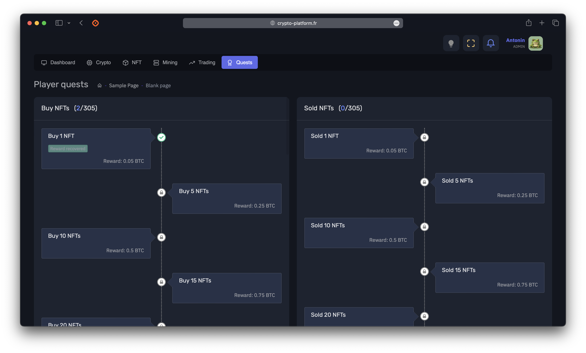

<h1 align="center">
  
 
 
  CryptoPlatform
</h1>

<h4 align="center">A complete crypto/NFT ecosystem based on real-time data and analytics.</h4>

# Dashboard

The platform offers a dashboard with an overview of the user's wallet, including the total value in USD, the distribution
of cryptocurrencies, NFTs, and mining servers. The dashboard also displays the user's level, the rewards, and the
progression in the quests.

# Crypto Wallet

The platform offers users a virtual USD wallet, regularly updated with USD funds, allowing the purchase of Bitcoin (
BTC). These BTC can then be converted into other cryptocurrencies, including a stablecoin, thus facilitating the
management of the digital wallet. The platform offers various widgets to monitor the evolution of the wallet in real
time. The price of cryptocurrencies is updated every minute via the Yahoo Finance API.

# Trading

Users can 'bet' their tokens using a leverage system to speculate on the rise or fall of values. The wagered tokens are
separated from the main wallet. Trading operations are visualized through an interactive chart, displaying the user's
movements, such as entry points, as well as gains in real time. Options such as stop loss and stop win are available.
Users can open one position at a time on each cryptocurrency per day, to accumulate a maximum of 5 open positions
simultaneously per token. Gains are automatically transferred to the main wallet when a stop condition is reached. The
position can be closed manually at any time. Users can also consult the history of their transactions (the last 15) and
the associated gains.

# NFT

The platform also integrates a separate NFT section. NFTs can be acquired with ETH. Each NFT includes an image (
generated via MidJourney), a title, a collection, and a price evolving according to ETH fluctuations. A dedicated
marketplace allows the purchase and auction of NFTs, classified by collection, accompanied by a liked section (for
favorite NFTs), owned (for purchased NFTs) and bids (for ongoing auctions) to manage NFTs. NFTs can be purchased with
ETH, and sold against this cryptocurrency during auctions. Users will be able to use an NFT as an avatar on the
platform.

# Mining

The 'Mining' section allows users to acquire servers (they can buy several per server type) to mine cryptocurrencies (a
specific cryptocurrency per server type). The servers are classified by categories, with increasing cost and yield.
Revenues are generated in the cryptocurrency mined by the server, and are automatically transferred to the user's
wallet. An intuitive interface allows to manage the servers, to follow their state, the associated revenues as well as
the costs. The servers can be resold on the marketplace. The costs for each server are in the cryptocurrency mined by
the server. Payments for the servers are made every day at 1 am (UTC).

# Rewards

A level system rewards users based on their total wallet in cryptocurrencies and NFTs (valued in BTC), offering as an
advantage the increase of the gains of the mining servers.

# Quests

Users can complete quests to earn additional rewards (BTC). These quests are varied and are related to buying NFTs,
selling NFTs, placing bids and buying servers.

# Leaderboard

The leaderboard allows to follow the best users, and rewards are distributed regularly to the best traders, miners and
NFT collectors.

# Notifications

A notification system allows to inform users of important events, such as gains, losses, levels, rewards, updates,
auctions, etc.

# Details

Available Crypto: Bitcoin, Ethereum, Litecoin, Tether, Cardano, XRP, Dogecoin, Qtum, Basic Attention Token, NEO, Tezos,
Primecoin, SideShift Token, Steem, SaluS, OMG Network, Peercoin, Kobocoin, Diamond
NFT Categories: Cyberpunk, Cubes, Cats, Cars, Picasso, Greece, Penguins, Futuristic-city, Cyber-animals, Garden,
Haunted-houses, Historic buildings, Art, Nuketown, Space
Number of different servers for mining: 20

